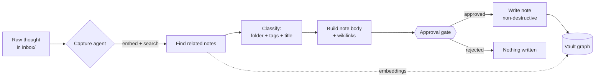

# second-brain-os

> Drop a raw thought into `inbox/`. An agent reads it, decides where it belongs,
> tags it, links it to what you already know, and — once you approve — files it
> as a proper note. Your notes stop being a pile and start being a graph.

A Markdown / Obsidian-style "second brain" with agentic workflows, in ~1,000
lines of Python. It runs **fully offline with no API key** in a deterministic
mock mode, and upgrades to a real LLM the moment you add `ANTHROPIC_API_KEY`.

---

## The problem

Note-taking tools are great at *capture* and terrible at *connection*. You jot
things down, and three weeks later you have 400 orphan notes and no idea that the
recipe idea you saved relates to the cooking note you wrote last month. Capture is
cheap; **filing, tagging, and linking are the expensive manual chores nobody
keeps up with.**

`second-brain-os` automates the expensive part:

- **Capture** a raw thought and an agent **classifies** it into the right folder,
  proposes tags, and finds related notes — then waits for your approval before
  writing anything.
- **Auto-linking** computes `[[wikilinks]]` between notes by embedding similarity.
- **Search** is semantic, not just substring: `search "breakfast"` finds the oats
  note even if it never says "breakfast".
- **Daily synthesis** rolls up recent captures and open projects into today's note.

---

## How capture works



The agent never writes silently: classification is side-effect-free, and only an
explicit approval (`--yes` or an interactive `y`) commits a file. Writes never
overwrite — a colliding name gets a `-2`, `-3` suffix.

---

## Quickstart

```bash
# 1. Clone and enter
git clone <your-fork-url> second-brain-os
cd second-brain-os

# 2. Install (mock mode needs only these three deps)
python3 -m venv .venv && source .venv/bin/activate
pip install -r requirements.txt

# 3. Build the embedding index over the seeded vault
python -m brain.cli index

# 4. Try it (all offline, no key needed)
python -m brain.cli search "morning breakfast routine"
python -m brain.cli capture "Idea: try a cold brew concentrate, 1:4 ratio"
python -m brain.cli link
python -m brain.cli daily
```

No `ANTHROPIC_API_KEY`? You'll see `[MOCK MODE — set ANTHROPIC_API_KEY for real
LLM]` and everything runs deterministically with a local hashing embedder. To
enable the real LLM path, copy `.env.example` to `.env`, set your key, and
`export $(cat .env | xargs)`.

> The package also installs a `brain` console script (`pip install -e .`), so you
> can run `brain search ...` instead of `python -m brain.cli search ...`.

---

## Example runs

Output shapes below are abbreviated; the real CLI renders rich tables/panels.

### `brain search "overnight breakfast oats"`

```
                       Search: 'overnight breakfast oats'
┏━━━━━━━┳━━━━━━━━━━━━━━━━━━━━━━━━━━━━━━━━━━┳━━━━━━━━━━━━━━━━━━━━━━━━━━━━━━━━━━━┓
┃ score ┃ note                            ┃ snippet                           ┃
┡━━━━━━━╇━━━━━━━━━━━━━━━━━━━━━━━━━━━━━━━━━━╇━━━━━━━━━━━━━━━━━━━━━━━━━━━━━━━━━━━┩
│ 0.553 │ notes/overnight-oats.md         │ A reliable overnight oats ratio…  │
│ 0.173 │ projects/garden-planter-build…  │ …fresh fruit on top in summer…    │
│ 0.150 │ inbox/raw-thought-cold-brew.md  │ …compare it against the overnight │
└───────┴─────────────────────────────────┴───────────────────────────────────┘
```

### `brain capture "Idea: a recipe for miso-glazed roasted carrots"`

```
╭───────────────────────── Proposed filing ─────────────────────────╮
│ Idea: a recipe for miso-glazed roasted carrots                     │
│                                                                    │
│ folder:  references/                                               │
│ tags:    cooking, ideas                                            │
│ related: garden-planter-build, sourdough-basics                    │
│ why:     mock: keyword heuristics                                  │
╰────────────────────────────────────────────────────────────────────╯
File this note? [y/N]            # approval gate — nothing written until you say yes
```

### `brain link`

```
                          Suggested wikilinks
┏━━━━━━━┳━━━━━━━━━━━━━━━━━━━━━━━━━━━━━━━━━━━━┳━━━━━━━━━━━━━━━━━━━━━━━━━━━━━━┓
┃ score ┃ source                           ┃ link                         ┃
┡━━━━━━━╇━━━━━━━━━━━━━━━━━━━━━━━━━━━━━━━━━━━━╇━━━━━━━━━━━━━━━━━━━━━━━━━━━━━━┩
│ 0.519 │ projects/trailmix-app-idea.md    │ [[meeting-trailmix-kickoff]] │
│ 0.461 │ projects/garden-planter-build.md │ [[the-pragmatic-programmer]] │
└───────┴──────────────────────────────────┴──────────────────────────────┘
Run with --apply to append these links (--yes to skip prompt).
```

### `brain daily`

```
╭──────────────────── Daily Note 2026-06-19 ────────────────────╮
│ # Daily Note — 2026-06-19                                     │
│                                                              │
│ ## Recent captures                                           │
│ - [[overnight-oats]] — Overnight Oats Formula #cooking        │
│ - [[meeting-trailmix-kickoff]] — Trailmix Kickoff #meeting    │
│                                                              │
│ ## Open projects                                             │
│ - [[trailmix-app-idea]] — Trailmix Hiking App                 │
╰────────────────────────────────────────────────────────────────╯
Run with --write to save into daily/ (--yes to skip prompt).
```

---

## Folder taxonomy

The vault is plain Markdown with YAML frontmatter — open it in Obsidian if you
like. Every note has `title`, `tags`, and `created`.

```text
vault/
├── inbox/        # raw, unfiled thoughts waiting to be processed
├── notes/        # evergreen knowledge: recipes, routines, methods
├── daily/        # dated daily notes (synthesized or hand-written)
├── projects/     # active project notes with milestones/roadmaps
└── references/   # book notes, articles, quotes — things you read
```

```text
---
title: Overnight Oats Formula
tags: [cooking]
created: '2026-06-12'
---

A reliable overnight oats ratio ...

## Related
- [[sourdough-basics]]
```

---

## Stack

| Concern            | Choice                                                      |
|--------------------|------------------------------------------------------------|
| Language           | Python 3.11+                                               |
| CLI / output       | `argparse` + `rich`                                       |
| Data models        | `pydantic` v2                                             |
| Frontmatter        | `pyyaml`                                                  |
| Embeddings (mock)  | local deterministic hashing embedder — no model, no network|
| LLM (real path)    | `anthropic`, default model `claude-opus-4-8` (optional)   |
| Tests / lint       | `pytest`, `ruff`                                          |

The embedder is a "hashing trick" bag-of-words vector with cosine similarity. It
is not a transformer, but it is fully deterministic, needs zero downloads, and is
good enough to demonstrate ranked retrieval and similarity-based linking. Swapping
in real embeddings is a one-function change in `brain/embedder.py`.

---

## Architecture

```text
brain/
├── cli.py        # `brain` entrypoint; subcommands + approval gate
├── agent.py      # capture (classify→approve→file), daily synthesis
├── llm.py        # MockLLM + AnthropicLLM behind one interface
├── index.py      # embedding index: build/persist/search/suggest-links
├── embedder.py   # deterministic hashing embedder + cosine
├── vault.py      # parse/render Markdown + non-destructive writes
├── models.py     # pydantic models (Note, Classification, SearchHit, ...)
└── config.py     # env detection: mock vs real, vault path, model id
```

---

## Roadmap

- [ ] Backlink index (show "linked from" on each note).
- [ ] Incremental indexing (only re-embed changed files via mtime).
- [ ] Pluggable real embeddings (sentence-transformers / Voyage / OpenAI) behind
      the same `embed()` interface.
- [ ] `brain process` to drain the whole `inbox/` in one approval-gated pass.
- [ ] Graph export (Mermaid / JSON) of the note network.
- [ ] Watch mode: file a note the moment it lands in `inbox/`.

---

## About

This is a personal portfolio project, built with AI assistance, using **entirely
synthetic sample data** — the seeded notes are fictional personal-knowledge topics
(recipes, book notes, a made-up "Trailmix" side project with fictional
collaborators Alex and Jordan). Nothing here reflects any employer, client, or
real person. It is meant to show clean agent design, an approval-gated write
model, and an offline-first architecture — not to be a finished product.

Licensed MIT. See [LICENSE](LICENSE).
